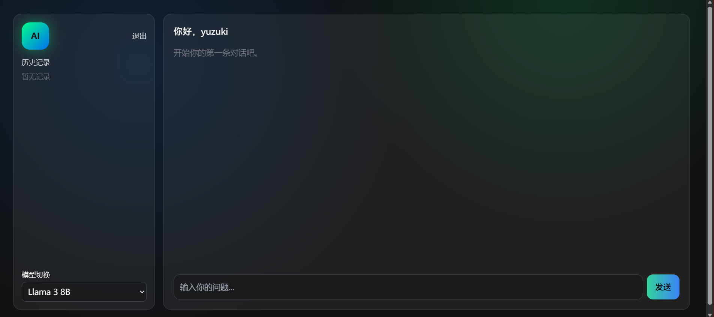
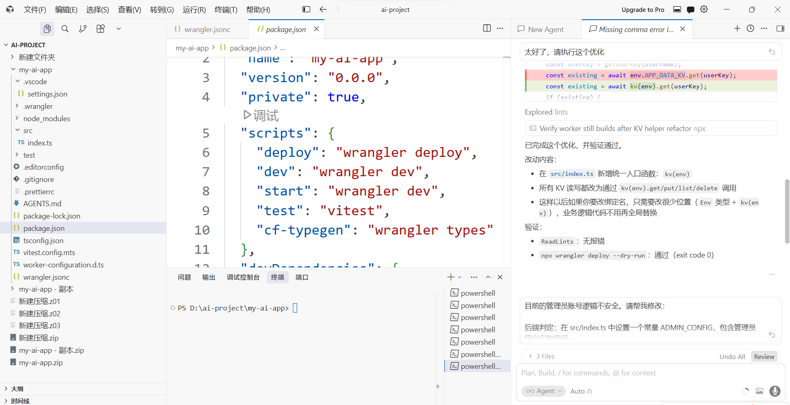

# AI 大模型聚合平台

## 项目简介
本项目是个人开发的轻量化大模型聚合平台，整合多家AI大模型接口，支持多模型快速切换、上下文连续对话，适合个人学习开发、接口调试与模型接入实战使用。

## 核心功能
- 多厂商大模型统一聚合管理
- 在线智能连续对话，保留上下文
- 轻量化架构，部署简单、易二次开发
- 适配电脑、手机移动端界面

## 技术栈
前端：HTML + CSS + JavaScript
部署支持：Cloudflare 等轻量化托管方案

## 项目界面预览

